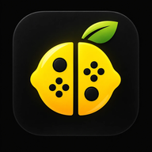

<!--
# SPDX-FileCopyrightText: Copyright 2026 Lemon-Project
# SPDX-License-Identifier: GPL-3.0-or-later

# SPDX-FileCopyrightText: Copyright 2025 Eden Emulator Project
# SPDX-License-Identifier: GPL-3.0-or-later

# SPDX-FileCopyrightText: 2018 yuzu Emulator Project
# SPDX-License-Identifier: GPL-2.0-or-later
-->
<!-- lang: en-GB -->

<h1 align="center">
  <br>
  
  <br>
  <b>Lemon</b>
  <br>
</h1>

<h4 align="center">An Android-only Nintendo Switch emulator built for Adreno GPUs.</h4>

<p align="center">
  <a href="https://github.com/Ghael-V/Lemon-Project/stargazers">
    
  </a>
  <a href="https://github.com/Ghael-V/Lemon-Project/releases">
    
  </a>
  <a href="https://github.com/Ghael-V/Lemon-Project/releases/latest">
    
  </a>
  <a href="https://github.com/Ghael-V/Lemon-Project/releases">
    
  </a>
  <a href="https://github.com/Ghael-V">
    
  </a>
</p>

<p align="center">
  <a href="#about">About</a> |
  <a href="#features">Features</a> |
  <a href="#changelog">Changelog</a> |
  <a href="#scope">Scope</a> |
  <a href="#building">Building</a> |
  <a href="#license">License</a>
</p>

## About

Lemon is a fork of [Eden](https://git.eden-emu.dev/eden-emu/eden), an open-source Switch emulator, trimmed down to
just the Android app and stripped of everything that isn't needed to build and run it on a single Adreno-equipped
Android device: no Qt/desktop/CLI targets, no multi-platform CI, no Mali/PowerVR-specific code paths.

Started as a personal build for the maintainer's own device(s); builds are now published on the
[Releases page](https://github.com/Ghael-V/Lemon-Project/releases) and the app checks for new ones on launch. It's
still a small, personal-scale project rather than a community one — there's a [Discord](https://discord.com/invite/PEE7Q5TVM5)
for feedback and support, but it isn't actively looking for external contributions; the source and releases are
public under the GPL.

Most of Lemon's additions are Android-side features layered on top of unchanged core emulation, plus changes to
what gets built, how, and the app's branding/UX. The one exception is savestate: making Quick Save/Quick Load work
reliably on real games required real changes to the emulated kernel itself (how a thread parked mid-syscall is
captured and restored) — see [Features](#features) below.

## Features

Everything below is specific to Lemon, on top of the Switch emulation it inherits from Eden/yuzu:

- **Lemon Cheater** — a live memory search/edit tool built into the in-game menu, Cheat-Engine style: exact-value
  and blind (unknown-value) searches, refine by increased/decreased/unchanged across passes, direct value editing,
  and freezing a found address so it stays fixed (infinite HP/ammo/etc.) via a background rewrite thread, without
  needing a premade cheat code.
- **Input macros** — record a sequence of on-screen controller presses with their timing and play it back, looped
  or once, for repetitive farming/grinding or practicing a sequence.
- **Quick Save / Quick Load (experimental)** — same-session savestate. Required a real fix in the emulated kernel
  itself: a guest thread parked mid-syscall (waiting on a condvar, an IPC reply, a timer...) lives inside a host
  fiber whose true resume point isn't in the register/memory snapshot a savestate captures, so a naive restore left
  it resuming into a world that no longer matched what it expected and the game aborted. Restore now leaves any
  still-waiting thread's own context and stack untouched, and retries around waits that depend on another guest
  thread instead of forcing them. Verified working repeatedly on real, demanding titles, but still not 100%
  reliable in every game/moment.
- **Controller layout presets** — a "Diseño del mando" entry in the pause menu with one-tap presets (default, big
  buttons, swapped D-pad/stick) plus quick access to the existing drag-and-resize edit mode, which used to be
  buried two menus deep with no indication it existed.
- **Game usage stats** — automatic per-game playtime, last-played time and session count, surfaced as a
  "Continue playing" shortcut on the games list and a sortable ranking on a dedicated Statistics screen.
- **Carousel/grid/list browsing** with per-card usage badges, favorites, and search/filtering across your library.
- **In-app updates** — checks this repository's GitHub Releases on launch and can download/install the new APK
  directly, with no path (missing release, no connection) that crashes the app.
- **Adreno GPU driver manager** — install alternate Adreno graphics drivers per game, plus per-game performance
  presets, frame generation and post-processing options.
- Save data import/export, Amiibo loading, and ad-hoc multiplayer, same as upstream Eden.

## Changelog

Full release notes (including Nightly/Experimental prereleases) are on the
[Releases page](https://github.com/Ghael-V/Lemon-Project/releases). Highlights:

As of v0.3, Nightly and Experimental have been merged into `main` and retired as separate channels — one
consolidated build going forward instead of splitting fixes across three branches.

- **v0.3.2-nightly.1** — Prerelease. Quick Save/Quick Load no longer aborts a restore over a memory region that's
  legitimately (not corruptly) become partially unmapped since the save; that region is now skipped instead, like an
  excluded sleeping-thread stack. Fixed a crash on some older Adreno/KGSL devices (confirmed on Snapdragon 888 and
  865) importing a custom GPU driver from your own file instead of the in-app downloader — two driver-manager UI
  labels were each building a full throwaway Vulkan device just to read two strings, and that churn stacked with a
  real driver reload into several rapid GPU-driver open/close cycles. New app icon and branding (launcher icon,
  default profile picture), plus a Ko-fi link on the About screen.
- **v0.3.1** — Fixed the auto-updater: `enable_update_checks` defaulted to `false`, so the update check never ran for
  anyone who hadn't manually found and flipped a Settings toggle they had no reason to know existed (now on by
  default); a separate tag-comparison bug meant Nightly-flavored builds' check silently bailed out even once
  enabled. Renamed remaining "Eden" leftovers to "Lemon" (device/system nickname in Settings > Advanced, plus a
  few lower-visibility internal identifiers).
- **v0.3** — Channel consolidation: Nightly and Experimental are merged into `main` and retired; a single build
  going forward. Quick Save/Quick Load now excludes threads asleep on a kernel wait from the restore instead of
  corrupting their stack/context, making it reliable on real multi-threaded games (previously same-session only,
  MVP-quality); savestate files shrunk ~3x via sparse-encoding zero-filled memory pages. Fixed a missing Vulkan
  synchronization barrier between compute-shader dispatches and the draws/copies that consume their output,
  causing intermittent black rendering artifacts (confirmed on Zelda: Tears of the Kingdom's procedural grass and
  shadows). Retry custom GPU driver loading instead of falling back to the (on some devices, unstable) system
  driver after a single attempt, fixing a repeated crash-on-launch pattern confirmed on Snapdragon 888/Adreno 660.
  Fixed a native out-of-bounds memory-unmap during shutdown that could corrupt state carried over into the next
  game session. Fixed a crash opening Settings after exiting emulation. Fixed Release builds silently sharing a
  stale build configuration with the debug-adjacent RelWithDebInfo build type (wrong reported version, unoptimized
  binary). Controller layout presets (Default/Big/Swapped D-pad↔stick) with one-tap apply from a new in-game menu.
  Discord and Buy Me a Coffee links on the About screen.
- **v0.2.3** — "Continue playing" card and playtime/last-played/session sorting on the Statistics screen; Lemon
  Cheater freeze/unfreeze with a dedicated "Frozen" view; input macro recorder/player; auto-updater pointed at
  this repository instead of upstream Eden's.
- **v0.2.2** — Game usage statistics (playtime, last played, session count), a new Statistics screen, and per-card
  usage badges on the games list.
- **v0.2.1** — Fixed the Lemon Cheater's context menu appearing behind game cards in Carousel view.
- **v0.2** — Added the Lemon Cheater live memory editor, plus assorted bug fixes.
- **v0.1** — Initial release.

## Scope

- **Android only.** Every desktop/CLI build target from upstream has been removed.
- **Adreno only.** Mali and PowerVR GPUs are explicitly out of scope and untested.
- **No keys, no firmware.** `prod.keys` and Switch firmware are not part of this repository and never will be —
  sourcing them from your own legally owned console is entirely on you. This fork does not touch key derivation,
  decryption, or DRM in any way; it only builds the emulator app.

## Building

Releases are built and published manually (see the [Releases page](https://github.com/Ghael-V/Lemon-Project/releases)
for prebuilt APKs). A [GitHub Actions workflow](.github/workflows/android-build.yml) exists to verify the build
still compiles, but it's manually triggered (`workflow_dispatch`), not run automatically on every push. To build
locally:

**Dependencies:** [Android Studio](https://developer.android.com/studio), NDK 27+ and CMake 3.22.1 (installable
from Android Studio's SDK Manager), and Git.

```sh
git clone --recursive https://github.com/Ghael-V/Lemon-Project.git
```

Then either open `Lemon-Project/src/android` in Android Studio and use `Run > Run 'app'`, or from a terminal:

```sh
export ANDROID_SDK_ROOT=path/to/sdk
export ANDROID_NDK_ROOT=path/to/ndk
cd Lemon-Project/src/android
./gradlew assembleMainlineRelWithDebInfo
```

`.ci/android/build.sh` (used by CI) wraps the same Gradle build with a friendlier flavor/build-type flag interface —
run it with `--help` for details.

## License

Lemon, like Eden, is licensed under the GPLv3 (or any later version). Refer to [LICENSE.txt](./LICENSE.txt).

## Special thanks

This project stands on the work of Eden and, before it, yuzu — and the broader community of Switch emulator forks
that came out of yuzu's shutdown:

- Yuzu
- Ryujinx
- Sudachi
- Citron
- Torzu
- Suyu
- Ryubing

And everyone who continues or has contributed to any of them. <3

<a href="https://buymeacoffee.com/ghael">Si te ha gustado mi trabajo puedes invitarme a un café</a>
