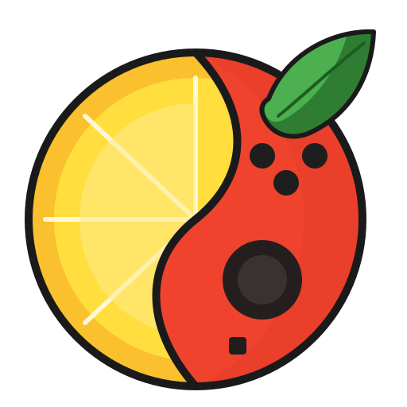

<!--
# SPDX-FileCopyrightText: Copyright 2026 Lemon-Project
# SPDX-License-Identifier: GPL-3.0-or-later

# SPDX-FileCopyrightText: Copyright 2025 Eden Emulator Project
# SPDX-License-Identifier: GPL-3.0-or-later

# SPDX-FileCopyrightText: 2018 yuzu Emulator Project
# SPDX-License-Identifier: GPL-2.0-or-later
-->
<!-- lang: en-GB -->

<h1 align="center">
  <br>
  
  <br>
  <b>Lemon</b>
  <br>
</h1>

<h4 align="center">An Android-only Nintendo Switch emulator built for Adreno GPUs.</h4>

<p align="center">
  <a href="https://lemon-emu.org">Website</a> |
  <a href="https://git.lemon-emu.org/lemon/Lemon-Project">Main repository</a> |
  <a href="https://lemon-emu.org/faq.html">FAQ</a> |
  <a href="https://lemon-emu.org/guide.html">Settings guide</a> |
  <a href="https://discord.com/invite/PEE7Q5TVM5">Discord</a>
</p>

> The main repository and the releases live at <https://git.lemon-emu.org/lemon/Lemon-Project>.
> This GitHub repository is a mirror. For help or to report a problem, use the Discord.

<p align="center">
  <a href="https://git.lemon-emu.org/lemon/Lemon-Project/releases/latest">
    
  </a>
  <a href="./LICENSE.txt">
    
  </a>
  <a href="https://github.com/Ghael-V/Lemon-Project/stargazers">
    
  </a>
  <a href="https://github.com/Ghael-V">
    
  </a>
</p>

<p align="center">
  <a href="#about">About</a> |
  <a href="#features">Features</a> |
  <a href="#changelog">Changelog</a> |
  <a href="#scope">Scope</a> |
  <a href="#building">Building</a> |
  <a href="#license">License</a>
</p>

## About

Lemon is an Android-only Nintendo Switch emulator built for Adreno GPUs and, since 1.1, Mali GPUs too. It runs on
the open-source emulation core developed by the yuzu community and the projects that followed it, trimmed down to
just what's needed to build and run it on Android phones and handhelds: no Qt/desktop/CLI targets, no
multi-platform CI, no PowerVR-specific code paths. It ships in three builds: **Lemon**, **Lemon Lite** (lighter
defaults for Adreno 6xx/7xx and Mali) and **Lemon Lite & Spoofed** (Lite under a benchmark app's package name).

Started as a personal build for the maintainer's own device(s), Lemon is now made by **Team Lemon**: Ghael, Seak
and Sidgey. Builds are published on the [Releases page](https://git.lemon-emu.org/lemon/Lemon-Project/releases) of
Lemon's own server and the app checks for new ones on launch (with the GitHub mirror as a fallback). It's still a
small project — there's a [Discord](https://discord.com/invite/PEE7Q5TVM5) for feedback and support, but it isn't
actively looking for external contributions; the source and releases are public under the GPL.

Most of Lemon's additions are Android-side features layered on top of unchanged core emulation, plus changes to
what gets built, how, and the app's branding/UX. The one exception is savestate: making Quick Save/Quick Load work
on real games required real changes to the emulated kernel and services themselves (how a thread parked
mid-syscall is captured and restored, and undoing what the game changed outside its memory since the save) — see
[Features](#features) below.

## Features

Everything below is specific to Lemon, on top of the Switch emulation it inherits from Eden/yuzu:

- **Online play on Nextendo Network** — sign in from Settings → Online (in the browser, Lemon never sees the
  password) and supported games play online on Nextendo's servers; Mario Kart 8 Deluxe races work.
- **Mali GPUs** — BCn textures, which Mali cannot sample, are recompressed to ASTC on the GPU instead of being
  stored uncompressed (Funko Fusion: 958 MB → 179 MB). Lemon Lite's driver downloader offers experimental PanVK
  builds for the Mali-G720 and Mali-G52, each only to its own GPU.
- **Three builds** — Lemon, Lemon Lite (0.75x resolution and asynchronous shaders by default, no bundled driver)
  and Lemon Lite & Spoofed. They install side by side; Lite can import keys, firmware, games and saves from Lemon.
- **Settings in ten categories with search** — Lemon, Graphics, Performance, Controls, In-game display, Console,
  Online, Content and data, Help, Advanced and debug, and a search on the settings home that finds any option at
  any depth and scrolls to it.
- **Redesigned interface** — a launcher-style library (carousel, grid or list), a quick in-game panel with a live
  performance card, redesigned Settings, About and Statistics screens, and full controller navigation, including
  gamepad shortcuts to open the in-game menu.
- **Lemon Cheater** — a live memory search/edit tool built into the in-game menu, Cheat-Engine style: exact-value
  and blind (unknown-value) searches over 32-bit integers and floats (a float matches within the precision you
  typed), refine by increased/decreased/unchanged across passes, direct value editing,
  and freezing a found address so it stays fixed (infinite HP/ammo/etc.) via a background rewrite thread, without
  needing a premade cheat code.
- **Input macros** — record a sequence of on-screen controller presses with their timing and play it back, looped
  or once, for repetitive farming/grinding or practicing a sequence.
- **Quick Save / Quick Load (experimental)** — same-session savestate that also survives dying, respawning and
  moving on in the game. A save waits for a settled moment; a load undoes what the game changed since the save
  outside its own memory (GPU buffers and mappings, thread stacks, files and other objects services handed out,
  threads destroyed and created again) and only then rewinds the memory and the threads. Threads parked
  mid-syscall keep the host fiber they live in, and services cannot answer a request while a save or a load
  runs. When something since the save cannot be undone yet, the load says so and changes nothing. Verified on
  Super Mario 3D World and Garfield; other games may still find something it cannot undo.
- **Controller layout presets** — the in-game menu's On-screen controls entry starts with Edit and one-tap layout
  presets (default, big buttons, swapped D-pad/stick), ahead of the touch control options.
- **Controller layout per game** — move and resize the on-screen controls for one game only, or for all of them.
- **Start in QLaunch** — with the firmware installed, opening Lemon boots straight into the console's home menu
  (once per launch: leaving it takes you to the library).
- **Reset all settings** — a red card at the bottom of Settings that puts every setting back to a fresh install's
  defaults, optionally also deleting every game's custom settings. Game folders, storage locations and each game's
  add-on choices are kept (unless the games' settings are deleted too).
- **Website, settings guide and FAQ** at [lemon-emu.org](https://lemon-emu.org), in English and Spanish, with a plain-language
  explanation of every setting.
- **Game usage stats** — automatic per-game playtime, last-played time and session count, surfaced as a
  "Continue playing" shortcut on the games list and a sortable ranking on a dedicated Statistics screen.
- **Carousel/grid/list browsing** with per-card usage badges, favorites, and search/filtering across your library;
  a progress bar while the library is scanned and pull down to refresh.
- **In-app updates** — checks Lemon's own server on launch (falling back to the GitHub mirror when it can't be
  reached), on demand from the About screen too, and can download/install the new APK directly, with no path
  (missing release, no connection) that crashes the app. A one-time "What's new" notice follows an update.
- **Adreno GPU driver manager** — install alternate Adreno graphics drivers per game, plus per-game performance
  presets, frame generation and post-processing options.
- Save data import/export, Amiibo loading, and ad-hoc multiplayer, same as upstream Eden.

## Changelog

Full release notes (including Nightly/Experimental prereleases) are on the
[Releases page](https://git.lemon-emu.org/lemon/Lemon-Project/releases). Highlights:

As of v0.3, Nightly and Experimental have been merged into `main` and retired as separate channels — one
consolidated build going forward instead of splitting fixes across three branches.

- **v1.1.0** — Three builds: **Lemon**, **Lemon Lite** and **Lemon Lite & Spoofed**. **Online play on Nextendo
  Network** (Mario Kart 8 Deluxe races). **Mali GPUs** supported: BCn textures recompressed to ASTC on the GPU, and
  experimental PanVK drivers in Lite. **Settings in ten categories, with search.** **No more flickering in Fast GPU
  mode**: Default GPU fence behavior now waits for the GPU (Balanced), so **Fast is the default GPU mode again**
  (Immediate gives the old speed back for games that do not flicker). A simpler in-game menu. Fixes: Crysis
  Remastered no longer crashes and its minimap stays in its corner (DrawTexture blit read a released framebuffer and
  left stale dynamic state); TOTK grass no longer vanishes (NCE page invalidation threw away GPU-written images);
  memory block ids no longer wrap (Mario & Luigi: Brothership); the multiplayer nickname is remembered again;
  sockaddr length in getsockname/getpeername/accept/recvfrom; input events without a device; asynchronous shaders
  look at the current draw; fewer render-pass breaks for small uniform buffers; capped and rotated logs, the reason
  the system ended the previous run, and "Lemon" instead of "Eden" in logs. From this release the APKs are signed
  with Lemon's own key through APK Signature Scheme v3 key rotation, so installs update in place.
- **v1.0.1** — **Quick Load survives dying** (and moving on in the game): it now undoes what the game changed
  since the save — GPU buffers and mappings, thread stacks, open files and other service objects, worker threads
  destroyed and created again — instead of refusing or freezing; it also no longer fails now and then when a
  service answered mid-load. Still experimental. **Grid and list views** for big libraries, a **scan progress bar**
  (including the one-time decompression of a solid `.nsz`, which used to look like an empty library for minutes)
  and pull down to refresh. **Start in QLaunch** option. A tap on the game closes the in-game menu. **Enable Legacy
  Rescale Pass** is listed under Hacks: it fixes the colored lines in Luigi's Mansion 3 (thanks to Elegant Demise
  for finding it). Updates: only a newer version is offered, and only a release with an APK for your build. Fixes:
  stopping a macro mid-way left its buttons pressed; installing or removing firmware, or importing data, during a
  library scan could crash; the CPU summary on chips this build does not know (Snapdragon 8 Elite Gen 5); fewer
  repeated warnings in the log; a missing TAS folder is created instead of logging an error.
- **v1.0.0** — Lemon has its own home: the code, the releases and the updates now live at
  [git.lemon-emu.org](https://git.lemon-emu.org/lemon/Lemon-Project) (GitHub is a mirror) and there is a website,
  [lemon-emu.org](https://lemon-emu.org), with a settings guide and an FAQ. A new interface: launcher-style library,
  quick in-game panel with a performance card, redesigned Settings/About/Statistics and full controller navigation;
  the new screens are translated to Spanish. Controller layout per game. Lemon Cheater searches, edits and freezes
  floats as well as integers. **Reset all settings** on the Settings screen. **GPU Mode is Accurate by default**:
  Fast made textures flicker in some games (confirmed on Garfield and Dragon Ball). Updates come from Lemon's own
  server with GitHub as a fallback, a Check for updates button on the About screen and a "What's new" notice after
  an update. Fixes: FIFA's missing player indicators, ball-direction lines, button prompts and text (a texture handle
  that travels with the vertices could not be followed by the shader compiler, so those draws were silently
  dropped; draws are now split by texture); FIFA 23 stuck at the splash screen (the network service lacked an
  `Ioctl` call); updates and DLC bundled in `.nsz` files showing the wrong version and no DLC; motion controls on
  every screen rotation, so they work on foldables and tablets held landscape. A card-based first-run setup, and
  more Turnip sources in the driver downloader. Known issue: in FIFA 23 the faces of some players can show wrong
  colors.
- **v0.3.5** — Coming from Eden, Citron or yuzu: Lemon imports your saves (plus keys and firmware if it has none)
  without opening the other emulator, from the first-run setup or the top of Settings. Android 12 support. The
  Lemon-Ade driver ships inside the app and is picked automatically on the Adreno 830, with an automatic fallback to
  the system driver if a game fails to start with it; Lemon-Ade is also first in the driver downloader. Games built
  for Switch firmware 22.0+ (ZBIC-compressed executables) load. New logo by Madeleine. Fixes: Add-ons toggles
  flipping other entries while scrolling, GPU-written textures evicted under memory pressure, the update notice
  never showing, plus several upstream Eden fixes (MK8D/SM3DW local wireless crash, controller-disconnect freeze,
  SGSR black screen on system screens, UE5 buffer sync races, IPS/pchtxt mods).
- **v0.3.4** — Hotfix: the loading screen could stay up forever after a game had started. The check that hides it
  once the first frame renders shared its message queue with the touch-overlay auto-hide, which clears that whole
  queue on every screen touch; the check was cancelled and never restarted. The adaptive-performance watchdog had
  the same problem and is fixed too.
- **v0.3.3** — Compressed dumps: `.nsz` and `.xcz` load directly. Block-compressed files (the `.xcz` default) are
  read in place with nothing written to disk; solid ones are decompressed once on first use and cached for later
  launches (least recently used entries evicted past 24 GiB). Rendering: added a missing barrier before indirect
  compute dispatches, compute dispatches are no longer skipped, and fixed crashes on dead compute descriptor slots
  and when rescaling texel buffer views. A corrupted or truncated pipeline cache is now rejected instead of crashing
  on launch. The loading screen stays up until the first real frame. Older Adreno devices (Snapdragon 888/865): the
  custom GPU driver is no longer loaded and unloaded repeatedly. Quick Load validates the whole savestate before
  touching any memory. Fixed a Lemon Cheater freeze deadlock and an out-of-memory abort when taking a snapshot. The
  game list scans faster (containers are no longer re-parsed on every query) and no longer races between threads,
  which could crash or drop updates/DLC. Also includes everything from v0.3.2-nightly.1 below.
- **v0.3.2-nightly.1** — Prerelease. Quick Save/Quick Load no longer aborts a restore over a memory region that's
  legitimately (not corruptly) become partially unmapped since the save; that region is now skipped instead, like an
  excluded sleeping-thread stack. Fixed a crash on some older Adreno/KGSL devices (confirmed on Snapdragon 888 and
  865) importing a custom GPU driver from your own file instead of the in-app downloader — two driver-manager UI
  labels were each building a full throwaway Vulkan device just to read two strings, and that churn stacked with a
  real driver reload into several rapid GPU-driver open/close cycles. New app icon and branding (launcher icon,
  default profile picture), plus a Ko-fi link on the About screen.
- **v0.3.1** — Fixed the auto-updater: `enable_update_checks` defaulted to `false`, so the update check never ran for
  anyone who hadn't manually found and flipped a Settings toggle they had no reason to know existed (now on by
  default); a separate tag-comparison bug meant Nightly-flavored builds' check silently bailed out even once
  enabled. Renamed remaining "Eden" leftovers to "Lemon" (device/system nickname in Settings > Advanced, plus a
  few lower-visibility internal identifiers).
- **v0.3** — Channel consolidation: Nightly and Experimental are merged into `main` and retired; a single build
  going forward. Quick Save/Quick Load now excludes threads asleep on a kernel wait from the restore instead of
  corrupting their stack/context, making it reliable on real multi-threaded games (previously same-session only,
  MVP-quality); savestate files shrunk ~3x via sparse-encoding zero-filled memory pages. Fixed a missing Vulkan
  synchronization barrier between compute-shader dispatches and the draws/copies that consume their output,
  causing intermittent black rendering artifacts (confirmed on Zelda: Tears of the Kingdom's procedural grass and
  shadows). Retry custom GPU driver loading instead of falling back to the (on some devices, unstable) system
  driver after a single attempt, fixing a repeated crash-on-launch pattern confirmed on Snapdragon 888/Adreno 660.
  Fixed a native out-of-bounds memory-unmap during shutdown that could corrupt state carried over into the next
  game session. Fixed a crash opening Settings after exiting emulation. Fixed Release builds silently sharing a
  stale build configuration with the debug-adjacent RelWithDebInfo build type (wrong reported version, unoptimized
  binary). Controller layout presets (Default/Big/Swapped D-pad↔stick) with one-tap apply from a new in-game menu.
  Discord and Buy Me a Coffee links on the About screen.
- **v0.2.3** — "Continue playing" card and playtime/last-played/session sorting on the Statistics screen; Lemon
  Cheater freeze/unfreeze with a dedicated "Frozen" view; input macro recorder/player; auto-updater pointed at
  this repository instead of upstream Eden's.
- **v0.2.2** — Game usage statistics (playtime, last played, session count), a new Statistics screen, and per-card
  usage badges on the games list.
- **v0.2.1** — Fixed the Lemon Cheater's context menu appearing behind game cards in Carousel view.
- **v0.2** — Added the Lemon Cheater live memory editor, plus assorted bug fixes.
- **v0.1** — Initial release.

## Scope

- **Android only.** Every desktop/CLI build target from upstream has been removed.
- **Adreno only.** Mali and PowerVR GPUs are explicitly out of scope and untested; the app may start on them,
  but they are not supported (see the [FAQ](https://lemon-emu.org/faq.html)).
- **No keys, no firmware.** `prod.keys` and Switch firmware are not part of this repository and never will be —
  sourcing them from your own legally owned console is entirely on you. Lemon does not touch key derivation,
  decryption, or DRM in any way; it only builds the emulator app.

## Building

Releases are built and published manually (see the [Releases page](https://git.lemon-emu.org/lemon/Lemon-Project/releases)
for prebuilt APKs). A [GitHub Actions workflow](.github/workflows/android-build.yml) exists to verify the build
still compiles, but it's manually triggered (`workflow_dispatch`) and only runs on the GitHub mirror. To build
locally:

**Dependencies:** [Android Studio](https://developer.android.com/studio), NDK 27+ and CMake 3.22.1 (installable
from Android Studio's SDK Manager), and Git.

```sh
git clone --recursive https://git.lemon-emu.org/lemon/Lemon-Project.git
```

Then either open `Lemon-Project/src/android` in Android Studio and use `Run > Run 'app'`, or from a terminal:

```sh
export ANDROID_SDK_ROOT=path/to/sdk
export ANDROID_NDK_ROOT=path/to/ndk
cd Lemon-Project/src/android
./gradlew assembleMainlineRelWithDebInfo
```

`.ci/android/build.sh` (used by CI) wraps the same Gradle build with a friendlier flavor/build-type flag interface —
run it with `--help` for details.

## License

Lemon, like Eden, is licensed under the GPLv3 (or any later version). Refer to [LICENSE.txt](./LICENSE.txt).

## Special thanks

This project stands on the open-source work of the yuzu community and of the projects that came after it:

- Yuzu
- Eden
- Ryujinx
- Sudachi
- Citron
- Torzu
- Suyu
- Ryubing

And everyone who continues or has contributed to any of them. <3

Thanks to our patrons, Xefir and HungNguYen, for supporting Lemon. <3

A very special thank you to Madeleine, who designed Lemon's logo for free and put up with endless
rounds of changes with a lot of patience. Thank you, Madeleine! <3

<a href="https://buymeacoffee.com/ghael">Si te ha gustado mi trabajo puedes invitarme a un café</a>

<a href="https://ko-fi.com/LemonProject">O si lo prefieres, un Ko-Fi... Gracias!</a>

